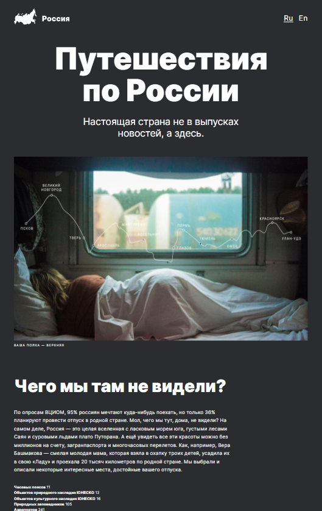

# Проектная работа "Путешествие по России"

"Путешествие по России" - это одностраничный сайт с адаптивным дизайном для нескольких размеров экранов: большие и средние мониторы (1280px+), малые мониторы (1024-1280), планшеты (768-1024), большие смартфоны (425-768), малые смартфоны (-425). Разработка велась по модели "Desktop first"

1980px

1024px

768px

425px
